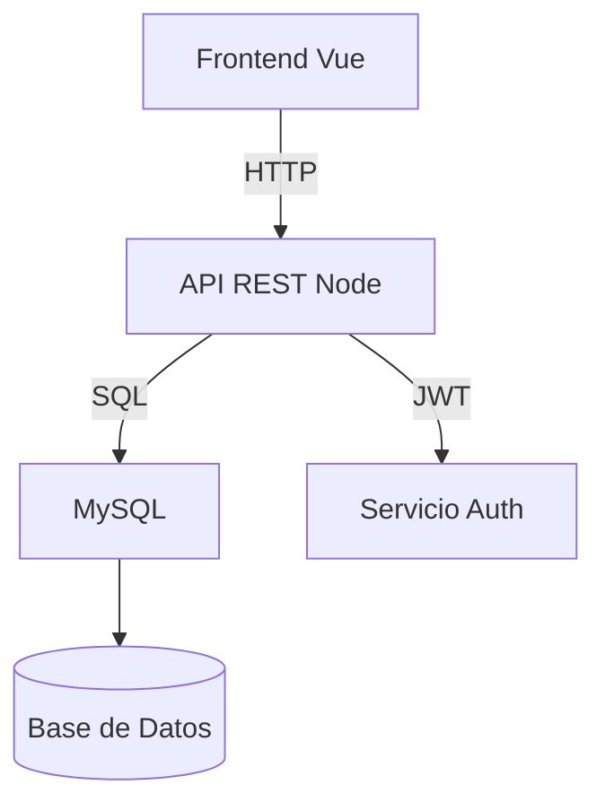

import StoryIntro from '../../../../components/StoryIntro.astro';
import Aclaracion from '../../../../components/Aclaracion.astro';
import Comparativa from '../../../../components/Comparativa.astro';
import CasoPractico from '../../../../components/CasoPractico.astro';

> 🗺️ **Estás en:** 🔧 **U1 · Evolucionar la arquitectura** → 06 · Documentar la arquitectura

<StoryIntro icono="📖" titulo="Contexto de este capítulo">
  Sergio le pasa el proyecto a un compañero para que lo pruebe. El
  compañero abre el repositorio y no sabe ni por dónde empezar. No hay
  README. No hay instrucciones de instalación. No hay diagrama de la
  arquitectura. Tiene que preguntar a Sergio todo, y Sergio está en
  clase y no puede contestar.

  Este capítulo es la solución: documentar lo suficiente para que
  cualquier persona (incluido tu yo del futuro) entienda tu proyecto
  sin tener que preguntar.
</StoryIntro>

## La idea en una frase

> Documentar no es opcional. Un proyecto sin documentación es como una
> casa sin plano: funciona, pero nadie sabe dónde está el interruptor
  principal.

## Por qué documentar

Hay tres razones concretas:

1. **Para ti del futuro** — en 3 meses no recordarás por qué tomaste
   esa decisión técnica o cómo se instala el proyecto.
2. **Para tu equipo** — tus compañeros necesitan entender la arquitectura
   sin tenerte a ti disponible 24/7.
3. **Para el tribunal** — el evaluador necesita entender qué has hecho
   y por qué. Si no lo documentas, no lo sabe.

## Los tres documentos esenciales

### 1. README.md

El archivo más importante del proyecto. Es lo primero que ve quien abre
el repositorio. Debe contener:

```markdown
# Nombre del Proyecto

Descripción breve de qué hace y para qué sirve.

## Instalación
Paso a paso para levantar el proyecto en local.

## Estructura del proyecto
Explicación de las carpetas y su propósito.

## Uso
Cómo usar la aplicación (endpoints, pantallas, etc.).

## Tecnologías utilizadas
Lista de tecnologías y por qué se eligieron.

## Equipo
Nombres y roles del equipo.
```

**No hace falta ser exhaustivo.** Con 20-30 líneas bien escritas es
suficiente. Lo importante es que alguien que no seas tú pueda levantar
el proyecto en 5 minutos.

### 2. Diagrama de arquitectura

Un diagrama visual que muestre cómo se comunican las partes del sistema.
No necesita ser elaborado: un esquema en ASCII o una imagen simple
valen.

```
┌─────────────┐     HTTP      ┌─────────────┐
│  Frontend   │ ────────────→ │  Backend    │
│  (Vue/React)│ ←──────────── │  (Node/Exp) │
└─────────────┘   JSON API    └──────┬──────┘
                                     │
                                     │ SQL
                                     ↓
                              ┌─────────────┐
                              │   Base de   │
                              │    Datos    │
                              └─────────────┘
```

También puedes usar herramientas como Mermaid, Draw.io o Excalidraw.
Lo importante es que se entienda la comunicación entre componentes.

### 3. ADR (Architecture Decision Records)

Documentar las decisiones técnicas que has tomado y por qué. Ya viste
el formato en el punto 03. Cada decisión importante merece un ADR:

```
# ADR-001: Usar Vue.js como framework frontend

## Estado: Aceptado

## Contexto
Necesitamos un framework frontend para gestionar componentes
reutilizables en 20+ pantallas.

## Decisión
Usaremos Vue.js 3 con Composition API.

## Alternativas consideradas
- React: más popular, pero el equipo tiene más experiencia con Vue
- HTML plano: insuficiente para la complejidad de la UI
- Svelte: alternativa moderna pero menor ecosistema

## Consecuencias
- Dependencia de Vue y su ecosistema
- Necesidad de aprender Composition API si solo se conoce Options API
- Acceso a componentes UI gratuitos (PrimeVue, Vuetify)
```

<Comparativa
  dialogos={[
    { quien: "Sin documentar", texto: "El proyecto funciona, pero nadie sabe cómo levantarlo sin preguntar. Cuando el autor se va de baja, el equipo pierde 2 días descubriendo cómo se instala." },
    { quien: "Con documentar", texto: "Hay un README claro. El compañero nuevo levanta el proyecto en 10 minutos. El ADR explica por qué se usó Vue en vez de React. Todo el mundo puede trabajar." },
  ]}
  titulo="Dos realidades"
/>

<Aclaracion pregunta="¿Documentar no es una pérdida de tiempo? No estoy programando mientras escribo un README">
  Es al revés: documentar **ahorra** tiempo. Si un compañero te pregunta
  "¿cómo se instala?", la respuesta es "mira el README". Si el tribunal
  pregunta "¿por qué usaste MongoDB?", la respuesta es "mira el ADR-003".

  Un ADR te lleva 5 minutos. Una conversación de 20 minutos para
  explicar lo mismo te lleva 20 minutos. Y el ADR queda para siempre.
</Aclaracion>

## Cómo documentar diagramas sin ser experto

No necesitas ser diseñador. Estas herramientas son suficientes:

| Herramienta | Tipo | Ventaja |
|-------------|------|---------|
| ASCII art | Texto | No necesita herramientas, va en el README |
| Mermaid | Markdown | Se renderiza en GitHub automáticamente |
| Draw.io | Web | Gratis, muchas plantillas |
| Excalidraw | Web | Estilo manuscrito, fácil de usar |
| Lucidchart | Web | Profesional, tiene tier gratuito |

**Ejemplo con Mermaid** (se puede incluir directamente en el README):

````

````

## Documentación viva vs documentación muerta

La documentación muerta es la que escribes una vez y nunca actualizas.
Si el código cambia pero el README no, el README miente. La documentación
viva se actualiza con el código.

**Regla práctica**: cuando cambies algo que afecte a la arquitectura,
actualiza el README o el ADR en el mismo commit. Así nunca queda
desactualizada.

```
git commit -m "feat: cambiar de MySQL a PostgreSQL
docs: actualizar ADR-002 y README con el cambio de BD"
```

<CasoPractico titulo="El tribunal que preguntó por la arquitectura">
  Un equipo defendió su proyecto PI2 sin documentación de arquitectura.
  El tribunal preguntó:

  - "¿Por qué esta estructura de carpetas?" — No supieron explicar.
  - "¿Cómo se comunican frontend y backend?" — Dibujaron un diagrama
    confuso en la pizarra.
  - "¿Por qué elegiste esta base de datos?" — "Porque sí".

  Otro equipo, con la misma calidad de código, presentó su README,
  diagrama de arquitectura y 3 ADRs. El tribunal vio que habían
  pensado antes de codear. Nota: 8 vs 6.

  **Lección**: el código demuestra que sabes programar. La documentación
  demuestra que sabes **pensar**.
</CasoPractico>

## Mini-chequeo

**Pregunta 1.** ¿Cuáles son los tres documentos esenciales de un
proyecto DAW?
A) README, diagrama de arquitectura y ADR · B) Código fuente, tests y
comments · C) Manual de usuario, guía de instalación y FAQ

**Pregunta 2.** ¿Qué es un ADR?
A) Un tipo de test · B) Un documento que justifica una decisión técnica
· C) Un formato de commit

<details>
<summary>...Respuestas...</summary>

1. **A**. README (para levantar el proyecto), diagrama de arquitectura
   (para ver cómo se comunican las partes) y ADR (para justificar
   decisiones técnicas).
2. **B**. Architecture Decision Record: un documento que explica qué
   se decidió, por qué, qué alternativas había y qué consecuencias tiene.

</details>

## Resumen en 3 frases

1. El **README** es lo primero que ve quien abre tu proyecto: incluye
   instalación, estructura y uso en 20-30 líneas.
2. Los **diagramas** muestran la comunicación entre componentes. No
   necesitan ser elaborados: un esquema en ASCII o Mermaid vale.
3. Los **ADR** justifican las decisiones técnicas. 5 minutos de
   documentación ahorran 20 minutos de explicaciones.

> 🐛 **Vocabulario rápido**

| Término | Idea general |
|---|---|
| **README** | Archivo de texto que explica qué es el proyecto y cómo se usa |
| **ADR** | Architecture Decision Record: documento que justifica una decisión de diseño |
| **Diagrama de arquitectura** | Representación visual de cómo se comunican las partes del sistema |
| **Documentación viva** | Documentación que se actualiza junto con el código |
| **Mermaid** | Herramienta de diagramas en texto que se renderiza en GitHub |

📚 [Volver al índice de la unidad](/ApuntesProyectoDAW/apuntes-pi2/u1-arquitectura-web) · **Anterior:** [05 · Versionado y ramas](/ApuntesProyectoDAW/apuntes-pi2/u1-arquitectura-web/05-versionado-y-ramas) · **Siguiente:** [07 · Deuda técnica en acción](/ApuntesProyectoDAW/apuntes-pi2/u1-arquitectura-web/07-deuda-tecnica-en-accion)
