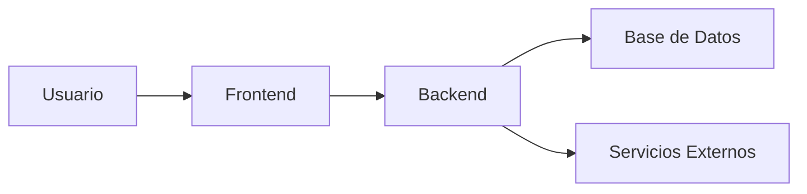
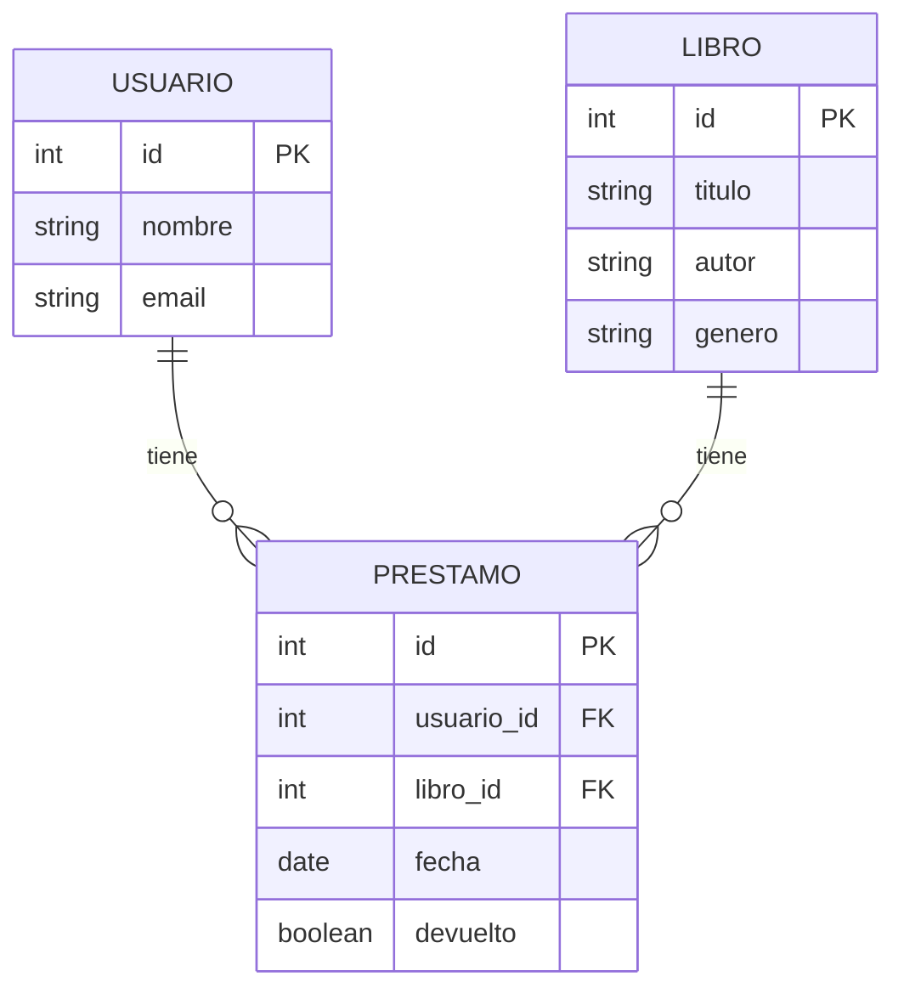

import StoryIntro from '@components/StoryIntro.astro';
import Aclaracion from '@components/Aclaracion.astro';

<StoryIntro icono="📐" titulo="Un buen diagrama ahorra mil reuniones">
  Los diagramas no son dibujos bonitos: son **herramientas de comunicación**.
  Un diagrama claro te ayuda a entender, planificar y explicar tu arquitectura.
</StoryIntro>

## 📬 La idea en una frase

> **Un diagrama es una imagen que explica cómo funciona tu sistema sin necesidad de leer código.**

No es arte. Es **comunicación visual** que ahorra reuniones de 2 horas.

## 🃏 El algoritmo

El proceso de modelado tiene 3 pasos:

1. **Dibuja el contexto** — ¿Quién usa tu sistema y con qué interactúa?
2. **Dibuja los componentes** — ¿Qué piezas tiene tu sistema?
3. **Dibuja los flujos** — ¿Cómo interactúan las piezas?

## 👣 Paso a paso

### Paso 1: Modelo C4 (de arriba a abajo)

El modelo C4 documenta arquitectura en 4 niveles progresivos:

#### Nivel 1: Contexto

```
┌─────────────────────────────────────────────┐
│              SISTEMA                        │
│         Tu aplicación web                   │
└──────────────┬──────────────┬───────────────┘
               │              │
      ┌────────▼───────┐  ┌──▼──────────────┐
      │   Usuarios     │  │  Servicios      │
      │   (navegador)  │  │  Externos       │
      └────────────────┘  │  (email, pagos) │
                          └─────────────────┘
```

**Qué muestra**: quién usa el sistema y con qué otros sistemas interactúa.

#### Nivel 2: Contenedores

```
┌─────────────────────────────────────────────┐
│              SISTEMA                        │
│  ┌──────────┐  ┌──────────┐  ┌──────────┐  │
│  │ Frontend │  │ Backend  │  │   BD     │  │
│  │ (Vue)    │  │ (Express)│  │(Postgres)│  │
│  └──────────┘  └──────────┘  └──────────┘  │
└─────────────────────────────────────────────┘
```

**Qué muestra**: las piezas principales del sistema y cómo se comunican.

#### Nivel 3: Componentes

```
┌────────────────────────────────────┐
│           BACKEND                  │
│  ┌───────────┐  ┌───────────┐     │
│  │Controller │  │ Service   │     │
│  └─────┬─────┘  └─────┬─────┘     │
│        │              │           │
│  ┌─────▼─────┐  ┌─────▼─────┐     │
│  │  Routes   │  │Repository │     │
│  └───────────┘  └───────────┘     │
└────────────────────────────────────┘
```

**Qué muestra**: la estructura interna de cada contenedor.

#### Nivel 4: Código

**Qué muestra**: detalles de implementación (clases, interfaces). Solo si es necesario.

### Paso 2: Diagrama Entidad-Relación (ER)

```
┌───────────┐         ┌───────────┐
│  USUARIO  │         │  LIBRO    │
├───────────┤         ├───────────┤
│ PK id     │◄───┐    │ PK id     │
│ nombre    │    │    │ titulo    │
│ email     │    │    │ autor     │
│ password  │    │    │ genero    │
└───────────┘    │    │ valoracion│
                 │    └───────────┘
                 │          ▲
                 │          │
                 │    ┌─────┴─────┐
                 │    │ PRESTAMO  │
                 │    ├───────────┤
                 └───►│ FK usuario│
                      │ FK libro  │
                      │ fecha     │
                      │ devuelto  │
                      └───────────┘
```

**Símbolos UML**:
- `PK` = Primary Key (clave primaria)
- `FK` = Foreign Key (clave foránea)
- `◄───┐` = Relación 1:N (un usuario tiene muchos préstamos)
- `───►│` = Relación N:1 (un préstamo pertenece a 1 usuario)

### Paso 3: Diagrama de secuencia

```
Usuario         Interfaz         Service         Repository        BD
  │                │                │                │              │
  │──iniciar sesión►│                │                │              │
  │                │──verificar────►│                │              │
  │                │                │──buscar────────►│             │
  │                │                │                │──query──────►│
  │                │                │                │◄──resultado──│
  │                │                │◄──usuario──────│              │
  │                │◄──token────────│                │              │
  │◄──éxito────────│                │                │              │
```

**Qué muestra**: el flujo de mensajes entre objetos en un escenario concreto.

## 📊 El análisis: ¿cuándo es necesario cada diagrama?

| Diagrama | Cuándo usarlo | Complejidad |
|----------|---------------|-------------|
| **C4 Contexto** | Siempre, para entender el sistema | ⭐ |
| **C4 Contenedores** | Si tienes más de 1 pieza (frontend + backend + BD) | ⭐⭐ |
| **ER** | Siempre, si usas base de datos relacional | ⭐⭐ |
| **Secuencia** | Para flujos complejos (login, pago, etc.) | ⭐⭐⭐ |
| **Clases** | Solo si la arquitectura es muy compleja | ⭐⭐⭐⭐ |

## ⭐ Sé el Código, my friend…

### Herramientas para diagramas

| Herramienta | Tipo | Ventaja | Cuándo usarla |
|-------------|------|---------|---------------|
| **draw.io** | Web/Desktop | Gratis, muchas plantillas | Cualquier diagrama |
| **Mermaid** | Markdown | Integrado en GitHub, versionable | Diagramas simples |
| **dbdiagram.io** | Web | Específico para BD, genera SQL | Diagramas ER |
| **Excalidraw** | Web | Estilo dibujo a mano | Borradores informales |
| **PlantUML** | Texto | Como código, versionable | Diagramas complejos |

### Mermaid (ejemplo en Markdown)





<Aclaracion pregunta="¿Cuántos diagramas debo hacer?">
  Mínimo: un **diagrama de contexto** (C4 nivel 1) y un **diagrama ER**
  de tu base de datos. Si tu proyecto es más complejo, añade diagrama
  de contenedores y algún diagrama de secuencia para los flujos principales.
</Aclaracion>

## 🎯 Mini-chequeo

- [ ] ¿Tienes diagrama de contexto (C4 nivel 1)?
- [ ] ¿Tienes diagrama ER de tu base de datos?
- [ ] ¿Usas herramientas como draw.io o Mermaid?
- [ ] ¿Tus diagramas están versionados en el repo?
- [ ] ¿Al menos 1 diagrama de secuencia para flujo principal?

## ✅ Resumen en 3 frases

1. El diagrama **C4 de contexto** muestra quién usa tu sistema y con qué interactúa — es el punto de partida obligatorio.
2. El diagrama **ER** muestra tus tablas y relaciones — sin él, no puedes diseñar la BD.
3. Usa **draw.io o Mermaid** para dibujar y **versiona los diagramas** en el repositorio con el código.
