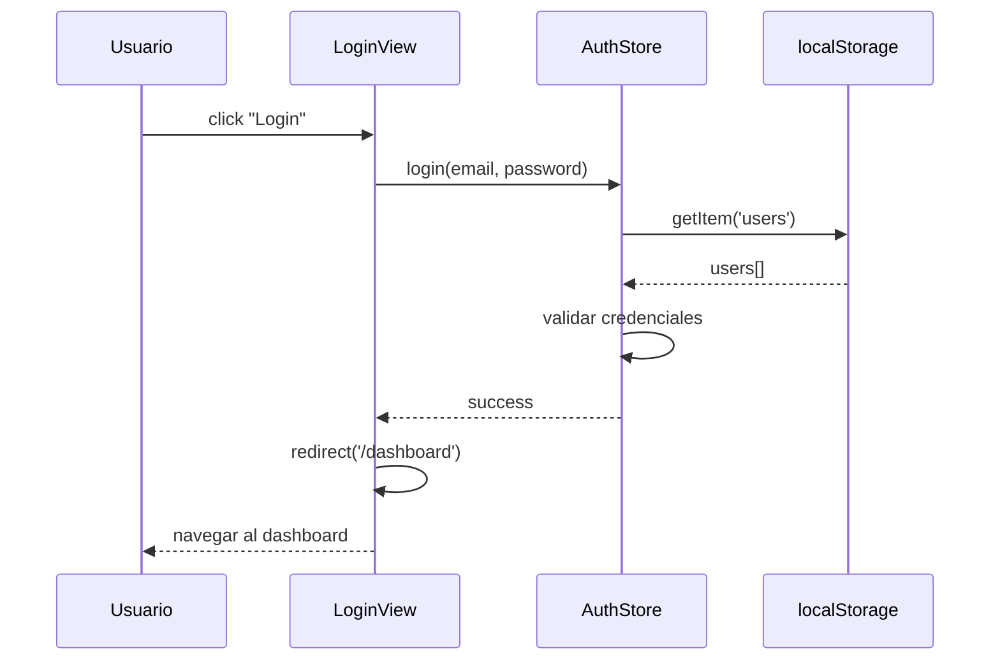

import StoryIntro from '@components/StoryIntro.astro';
import Aclaracion from '@components/Aclaracion.astro';
import Comparativa from '@components/Comparativa.astro';

> 🗺️ **Estás en:** 📐 **UD 2.5 · Diagramas** → 04 · Diagrama de secuencia

<StoryIntro icono="🔄" titulo="Un diagrama de secuencia cuenta la historia de una interacción">
  Un **diagrama de secuencia** muestra **quién habla con quién** y **en qué
  orden** durante un proceso concreto. Es como un guion de teatro: cada
  actor (componente) tiene su turno y las líneas muestran qué mensaje
  recibe cada uno.
</StoryIntro>

## 📬 La idea en una frase

> **Un diagrama de secuencia muestra la interacción entre componentes en el tiempo: quién envía qué mensaje, en qué orden y qué devuelve.**

Cuenta la historia de un flujo concreto, paso a paso.

---

## Los elementos del diagrama de secuencia

```
Usuario    Frontend    Store    localStorage
  │           │          │          │
  │──click──►│          │          │
  │           │──getTasks()──►│    │
  │           │          │──getItem()──►│
  │           │          │◄──data────│
  │           │◄──tasks──│          │
  │◄──render──│          │          │
  │           │          │          │
```

| Elemento | Símbolo | Ejemplo |
|----------|---------|---------|
| **Actor** | Recuadro en la parte superior | Usuario, Frontend, Store |
| **Línea de vida** | Línea vertical punteada | Existe durante todo el flujo |
| **Mensaje** | Flecha horizontal | `getTasks()`, `save()` |
| **Respuesta** | Flecha punteada de vuelta | `tasks[]`, `undefined` |
| **Actividad** | Rectángulo en la línea de vida | Procesando datos |

---

## Ejemplo: flujo de login

```
Usuario    LoginView    AuthStore    localStorage    Router
  │           │            │            │             │
  │──click──►│            │            │             │
  │  "Login"  │            │            │             │
  │           │──login()──►│            │             │
  │           │            │──getItem()─►│             │
  │           │            │◄──users────│             │
  │           │            │            │             │
  │           │            │──validar()──│             │
  │           │            │            │             │
  │           │◄──success──│            │             │
  │           │            │            │             │
  │           │──redirect()─────────────────────────►│
  │           │            │            │             │
  │◄──navegar───────────────────────────────────────│
  │           │            │            │             │
```

### Leyendo el diagrama

1. El **usuario** hace click en "Login"
2. **LoginView** llama a `AuthStore.login()`
3. **AuthStore** busca usuarios en `localStorage`
4. **AuthStore** valida las credenciales
5. Si es correcto, devuelve `success`
6. **LoginView** redirige con el Router
7. El **usuario** navega al dashboard

---

## Los 4 tipos de mensajes

| Tipo | Símbolo | Ejemplo |
|------|---------|---------|
| **Síncrono** | Flecha sólida → | `getTasks()` (espera respuesta) |
| **Asíncrono** | Flecha abierta →→ | `notificar()` (no espera) |
| **Respuesta** | Flecha punteada ···→ | `tasks[]` (devuelve datos) |
| **Creación** | Flecha con `create` | `new Task()` (crea objeto) |

---

## Ejemplo: flujo de crear tarea

```
Usuario    TaskForm    TaskStore    TaskRepository    localStorage
  │           │            │              │               │
  │──submit──►│            │              │               │
  │           │──create()─►│              │               │
  │           │            │──save()─────►│               │
  │           │            │              │──setItem()──►│
  │           │            │              │◄──OK─────────│
  │           │            │◄──task───────│               │
  │           │◄──success──│              │               │
  │           │            │              │               │
  │           │──render()──│              │               │
  │◄──update──│            │              │               │
  │           │            │              │               │
```

---

## Comparativa: secuencia vs texto

<Comparativa
  dialogos={[
    { quien: "Explicación en texto", texto: "El usuario hace submit. El formulario llama al store. El store llama al repository. El repository guarda en localStorage. Devuelve el task. El store actualiza el estado. El formulario re-renderiza. (8 líneas)" },
    { quien: "Diagrama de secuencia", texto: "[Dibujo con 6 flechas que muestra el mismo flujo en una imagen]" },
  ]}
  titulo="Un diagrama reemplaza un párrafo entero"
/>

---

## Cuándo crear diagramas de secuencia

| Flujo | ¿Merece un diagrama? |
|-------|---------------------|
| Login | ✅ Sí (flujo central) |
| Crear tarea | ✅ Sí (funcionalidad principal) |
| Exportar datos | ✅ Sí (flujo complejo) |
| Cargar una página | ⚠️ Opcional (simple) |
| Hacer click en un botón | ❌ No (demasiado trivial) |

**Regla**: si el flujo tiene **más de 3 pasos** o **más de 2 componentes**, un diagrama de secuencia ayuda.

---

## Aclaración: "¿Cómo dibujo un diagrama de secuencia?"

<Aclaracion icono="🤔" pregunta="¿Qué herramienta uso para crear diagramas de secuencia?">
Tres opciones principales:

1. **Mermaid** (recomendado): escribes el diagrama en código de texto. Se renderiza automáticamente
2. **draw.io**: herramienta visual gratuita para dibujar
3. **Excalidraw**: estilo manuscrito, rápido y bonito

**Para Mermaid**, el ejemplo del login sería:


</Aclaracion>

---

## Mini-chequeo

<details>
<summary>¿Qué muestra un diagrama de secuencia?</summary>

**Quién habla con quién** y **en qué orden** durante un proceso concreto. Muestra mensajes, respuestas y el tiempo.
</details>

<details>
<summary>¿Cuándo crear un diagrama de secuencia?</summary>

Cuando el flujo tiene **más de 3 pasos** o **más de 2 componentes**. Los flujos simples no necesitan diagrama.
</details>

<details>
<summary>¿Qué herramienta usar?</summary>

**Mermaid** (código de texto, se renderiza automáticamente), **draw.io** (visual, gratuito) o **Excalidraw** (manuscrito, rápido).
</details>

---

## ✅ Resumen en 3 frases

1. Un **diagrama de secuencia** muestra la interacción entre componentes en el tiempo: quién envía qué mensaje, en qué orden y qué devuelve.
2. Los elementos son: **actores** (componentes), **líneas de vida**, **mensajes** (flechas) y **respuestas** (flechas punteadas).
3. Crea un diagrama cuando el flujo tenga **más de 3 pasos** o **más de 2 componentes**: los flujos simples no lo necesitan.

---

> 📚 Volver al [índice de la unidad](../u2-5-diagramas) · Anterior: [03 — Diagrama ER](./03-diagrama-er) · Siguiente: [05 — Símbolos UML](./05-simbolos-uml)
