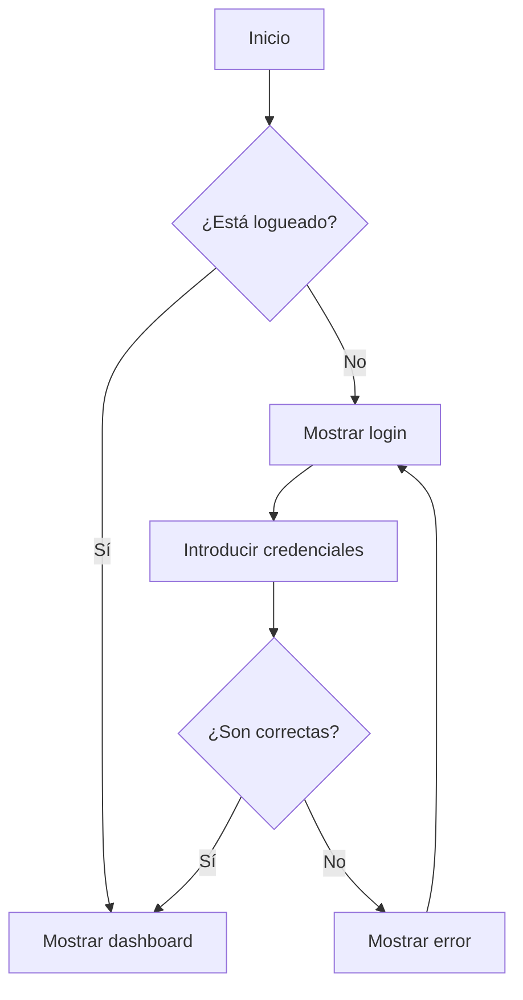
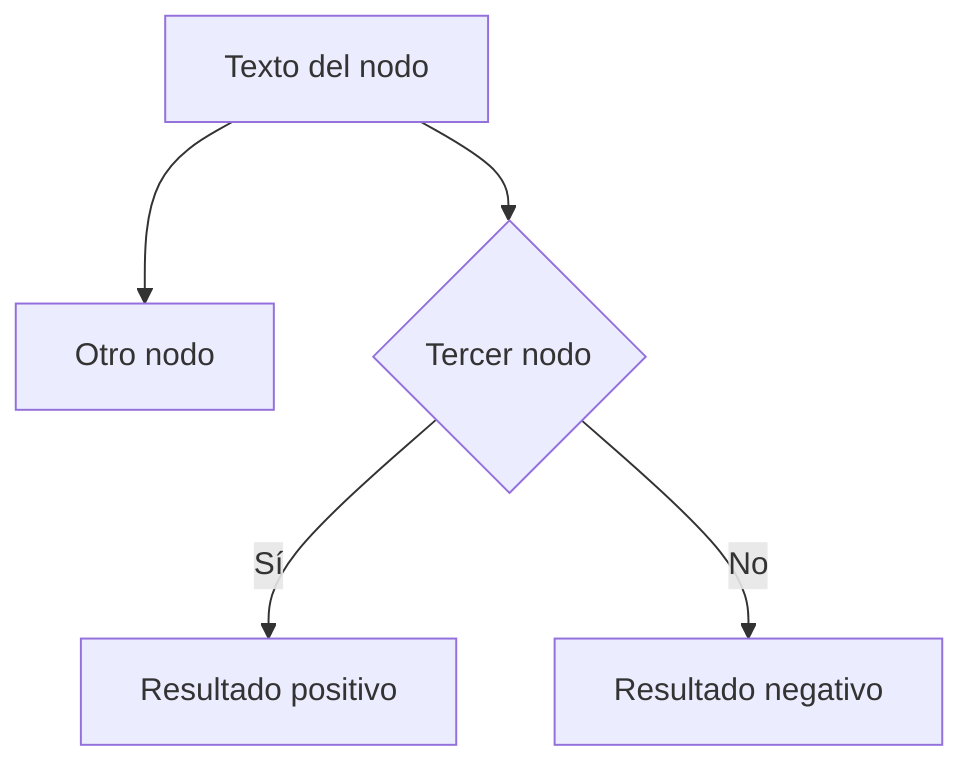
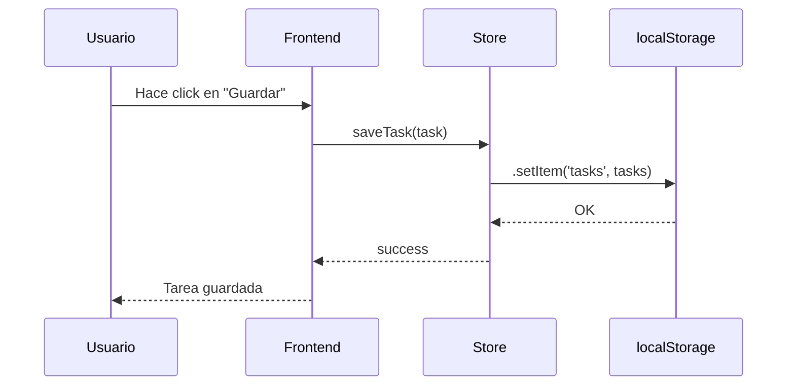
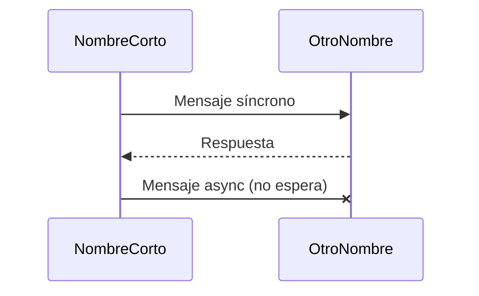
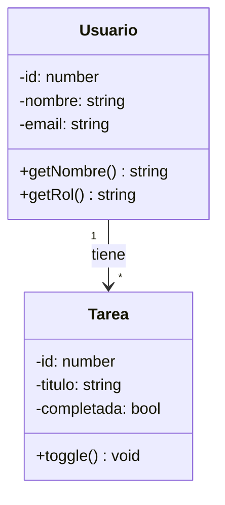
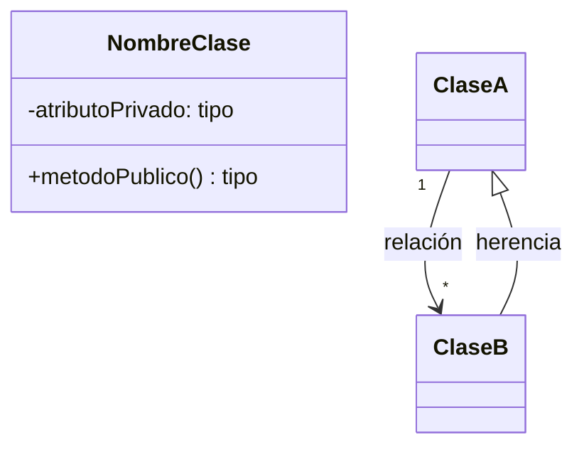
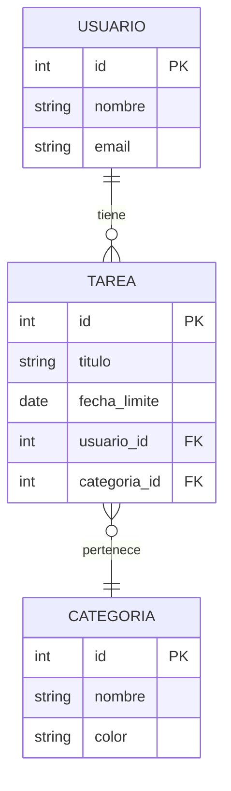
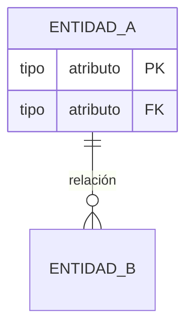
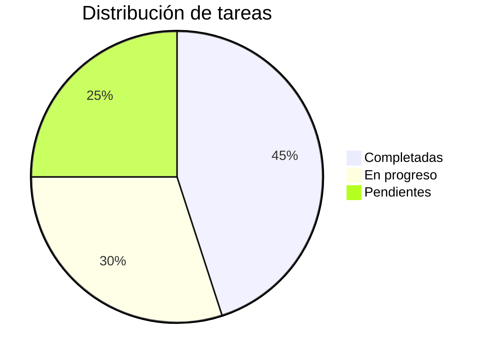

import StoryIntro from '@components/StoryIntro.astro';
import Aclaracion from '@components/Aclaracion.astro';
import Comparativa from '@components/Comparativa.astro';

> 🗺️ **Estás en:** 📐 **UD 2.5 · Diagramas** → 06 · Mermaid

<StoryIntro icono="✍️" titulo="Mermaid: diagramas como código, no como dibujos">
  **Mermaid** es un lenguaje de diagramas en **código de texto**: escribes
  el diagrama en una sintaxis simple y se renderiza automáticamente.
  GitHub, GitLab y muchas herramientas lo soportan. Es la forma más
  rápida de crear diagramas que se mantienen actualizados.
</StoryIntro>

## 📬 La idea en una frase

> **Mermaid convierte código de texto en diagramas: escribes la sintaxis, se renderiza automáticamente. Es como Markdown pero para diagramas.**

Si sabes escribir Markdown, sabes crear diagramas Mermaid.

---

## Flujo (Flowchart)

### Sintaxis básica

| Símbolo | Significado |
|---------|-------------|
| `-->` | Flecha |
| `-->|texto|` | Flecha con etiqueta |
| `[texto]` | Nodo rectangular |
| `{texto}` | Nodo diamante (decisión) |
| `((texto))` | Nodo circular |
| `TD` | Top-Down (arriba abajo) |
| `LR` | Left-Right (izquierda a derecha) |

---

## Secuencia (Sequence)

### Sintaxis básica

---

## Clases (Class Diagram)

### Sintaxis básica

---

## Entidad-Relación (ER)

### Sintaxis básica

| Símbolo | Significado |
|---------|-------------|
| `\|\|--o\|` | Uno a uno |
| `\|\|--o{` | Uno a muchos |
| `}o--o{` | Muchos a muchos |

---

## Flujo de datos (Pie Chart)

---

## Comparativa: Mermaid vs draw.io

<Comparativa
  dialogos={[
    { quien: "draw.io", texto: "Abro la herramienta, dibujo recuadros, arrastro flechas, le pongo texto. Bonito pero toma 20 minutos. Si cambio algo, redibujo todo." },
    { quien: "Mermaid", texto: "Escribo 10 líneas de código. Se renderiza automáticamente. Si cambio algo,编辑o una línea. Se actualiza solo." },
  ]}
  titulo="Mermaid es como Markdown: texto que se convierte en imagen"
/>

| Aspecto | Mermaid | draw.io |
|---------|---------|---------|
| **Velocidad** | Rápido (código) | Lento (dibujar) |
| **Mantenimiento** | Fácil (editar texto) | Difícil (redibujar) |
| **Colaboración** | Git (versionado) | Archivo binario |
| **Calidad visual** | Buena | Excelente |
| **Complejidad** | Limitada | Ilimitada |

---

## Aclaración: "¿Dónde puedo probar Mermaid?"

<Aclaracion icono="🤔" pregunta="¿Dónde veo mis diagramas Mermaid renderizados?">
Tres opciones:

1. **GitHub**: escribe Mermaid en un `.md` y GitHub lo renderiza automáticamente
2. **Mermaid Live Editor**: [mermaid.live](https://mermaid.live) — pega tu código y ve el resultado al instante
3. **VS Code**: extensión "Mermaid Preview" para ver mientras escribes

**GitHub es la más fácil**: creas un archivo `.md` con código Mermaid y lo ves en el repositorio.
</Aclaracion>

---

## Mini-chequeo

¿Qué es Mermaid?

Un lenguaje de **diagramas en código de texto**: escribes la sintaxis y se renderiza automáticamente. Soportado en GitHub, GitLab y VS Code.

¿Qué tipos de diagramas soporta?

**Flowchart** (flujo), **Sequence** (secuencia), **Class** (clases), **ER** (entidad-relación), **Pie** (tarta), **Gantt** y más.

¿Dónde ver los diagramas renderizados?

**GitHub** (renderiza automáticamente en `.md`), **mermaid.live** (editor en línea) y **VS Code** (extensión Mermaid Preview).

---

## ✅ Resumen en 3 frases

1. **Mermaid** es un lenguaje de diagramas en código de texto: escribes la sintaxis y se renderiza automáticamente.
2. Soporta **flowcharts** (flujo), **sequence** (secuencia), **class** (clases), **ER** (datos) y más: es el equivalente a Markdown pero para diagramas.
3. **GitHub** renderiza Mermaid automáticamente: crea un `.md` con código Mermaid y lo ves en el repositorio sin instalar nada.

---

> 📚 Volver al [índice de la unidad](../u2-5-diagramas) · Anterior: [05 — Símbolos UML](./05-simbolos-uml) · Siguiente: [07 — Herramientas de diagramas](./07-herramientas-diagramas)
