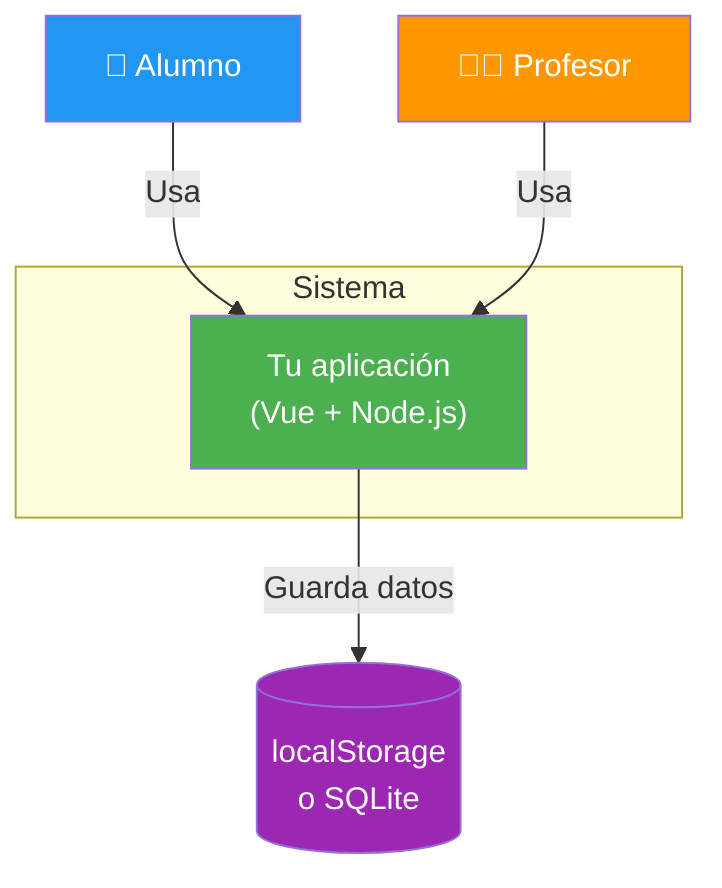
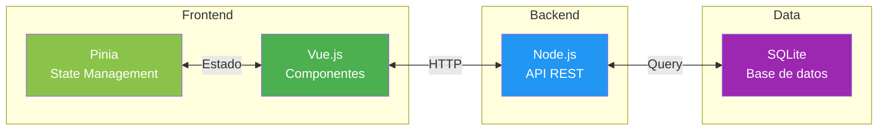
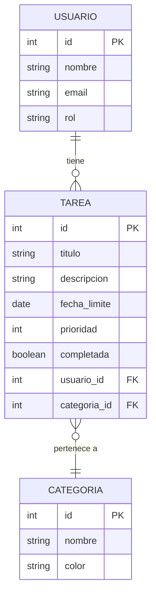
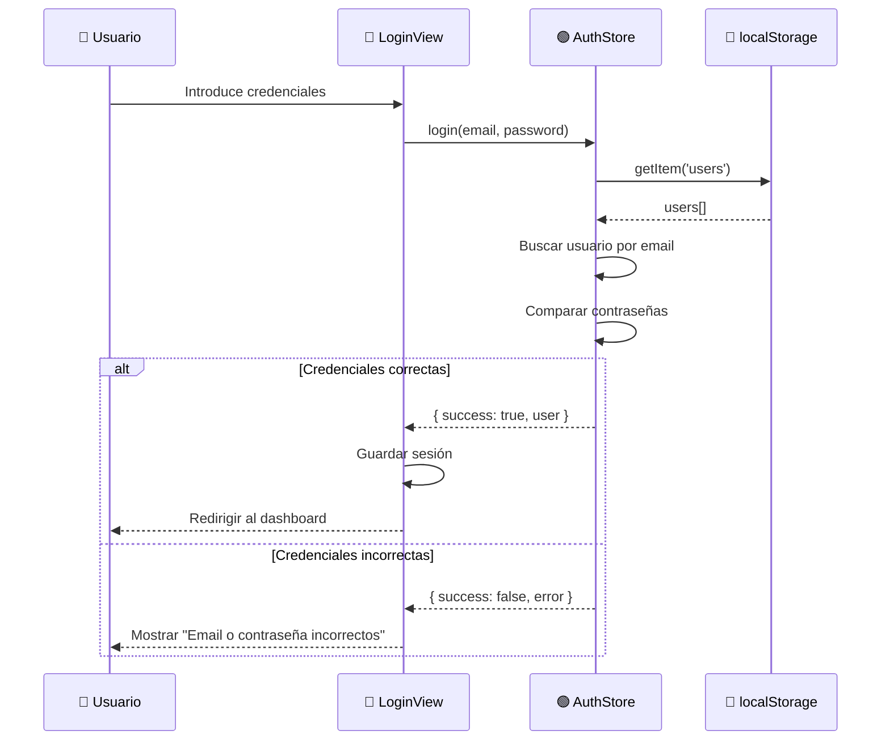
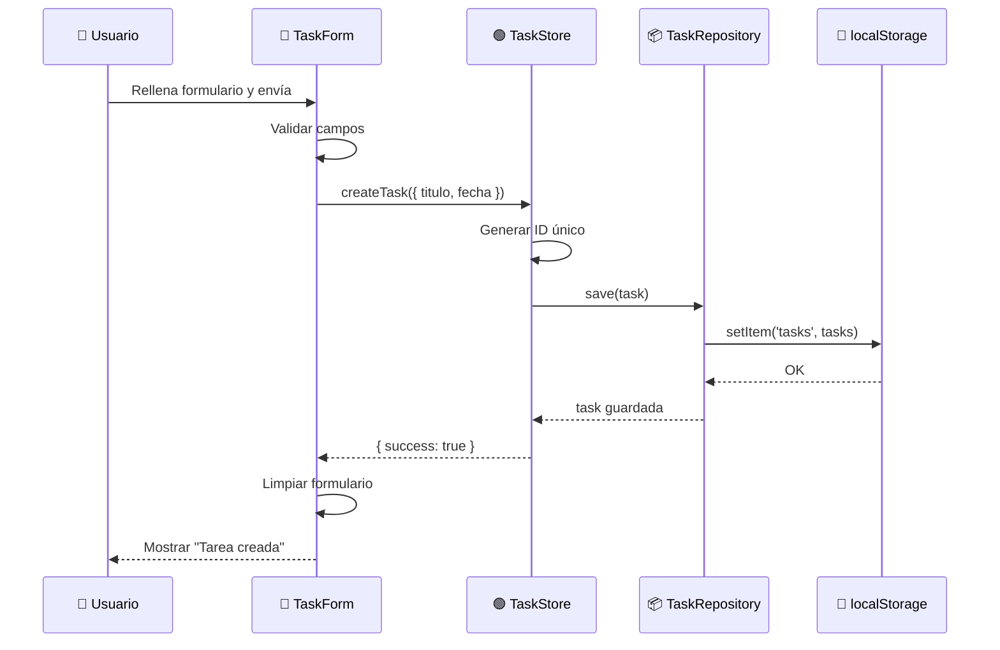
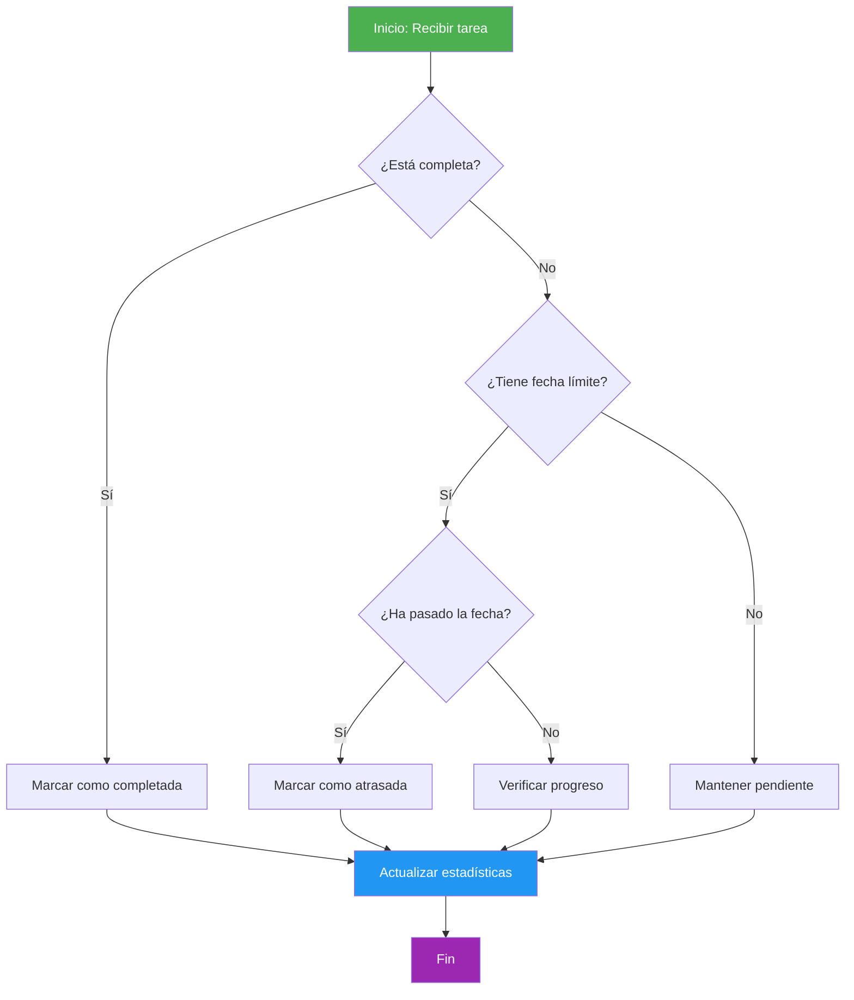

import StoryIntro from '@components/StoryIntro.astro';
import Aclaracion from '@components/Aclaracion.astro';

> 🗺️ **Estás en:** 📐 **UD 2.6 · Diagramas** → 08 · Template de diagramas

<StoryIntro icono="📋" titulo="Las plantillas que te ahorran empezar desde cero">
  Este template incluye las plantillas de Mermaid para los diagramas
  esenciales de Proyecto 2: C4 contexto, ER, secuencia y flujo.
  Cópialos, adapta los nombres a tu proyecto y tendrás tu documentación
  visual en 30 minutos.
</StoryIntro>

## 📬 La idea en una frase

> **Copia estas plantillas en un archivo `DIAGRAMAS.md` en tu repositorio, adapta los nombres y tendrás la documentación visual de tu proyecto.**

Los diagramas son documentación. Trátalos como tal.

---

## Template 1: C4 Nivel 1 — Contexto

---

## Template 2: C4 Nivel 2 — Containers

---

## Template 3: Diagrama ER

---

## Template 4: Diagrama de secuencia — Login

---

## Template 5: Diagrama de secuencia — Crear tarea

---

## Template 6: Flujo de decisión

---

## Aclaración: "¿Cómo uso estas plantillas?"

<Aclaracion icono="🤔" pregunta="¿Cómo adapto estas plantillas a mi proyecto?">
Tres pasos:

1. **Copia** el template que necesites en tu archivo `DIAGRAMAS.md`
2. **Cambia los nombres**: `USUARIO` → el nombre de tu entidad, `TaskForm` → tu componente real
3. **Añade/quita elementos**: si tu flujo tiene más pasos, añade más nodos

**No necesitas entender toda la sintaxis de Mermaid**. Copia, cambia nombres y funcionará.
</Aclaracion>

---

## Mini-chequeo

¿Qué templates incluye?

6 templates: **C4 contexto**, **C4 containers**, **ER**, **secuencia login**, **secuencia crear tarea** y **flujo de decisión**.

¿Cómo adapto los templates?

**Copia**, **cambia los nombres** (entidades, componentes) y **añade/quita elementos** según tu proyecto.

¿Dónde guardo los diagramas?

En un archivo **`DIAGRAMAS.md`** en la raíz de tu repositorio. GitHub renderiza Mermaid automáticamente.

---

## ✅ Resumen en 3 frases

1. El template incluye **6 diagramas**: C4 contexto, C4 containers, ER, secuencia login, secuencia crear tarea y flujo de decisión.
2. **Copia, cambia nombres y adapta** a tu proyecto: no necesitas entender toda la sintaxis de Mermaid.
3. Guarda todo en **`DIAGRAMAS.md`**: GitHub lo renderiza automáticamente y el profesor puede ver tus diagramas.

---

<a class="nav-box nav-box-prev" href="../07-herramientas-diagramas">
  ← Anterior
  07 — Herramientas
</a><a class="nav-box nav-box-next" href="../09-cierre">
  Siguiente →
  09 — Cierre
</a>

<a class="nav-unidad-volver" href="../"> Volver al índice de la unidad</a>

